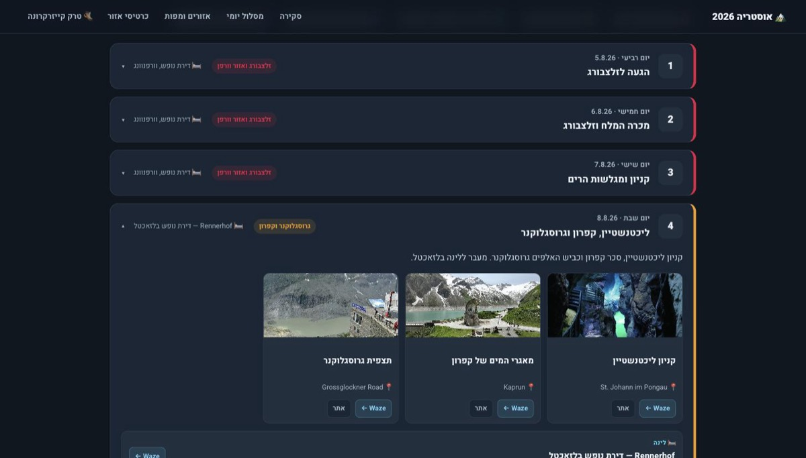
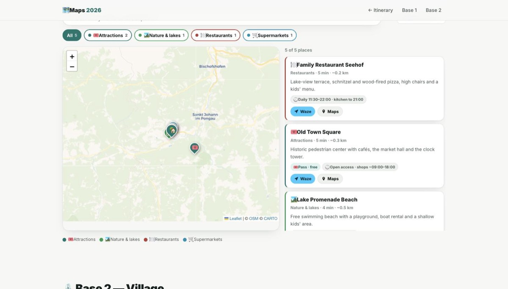
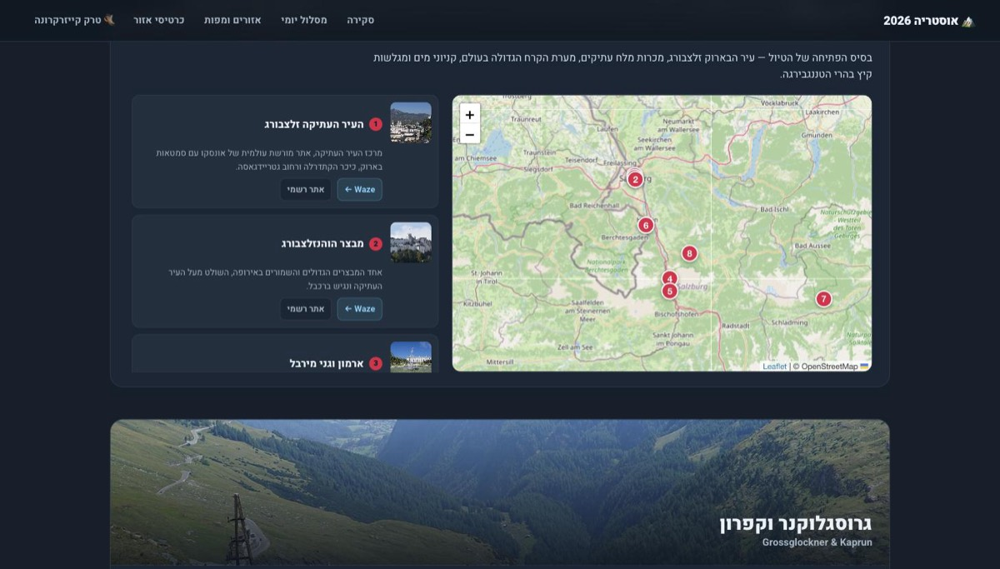
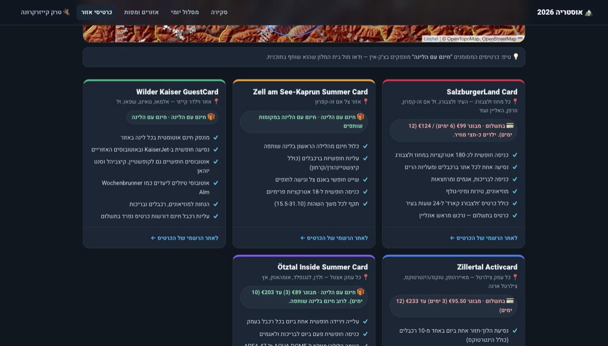
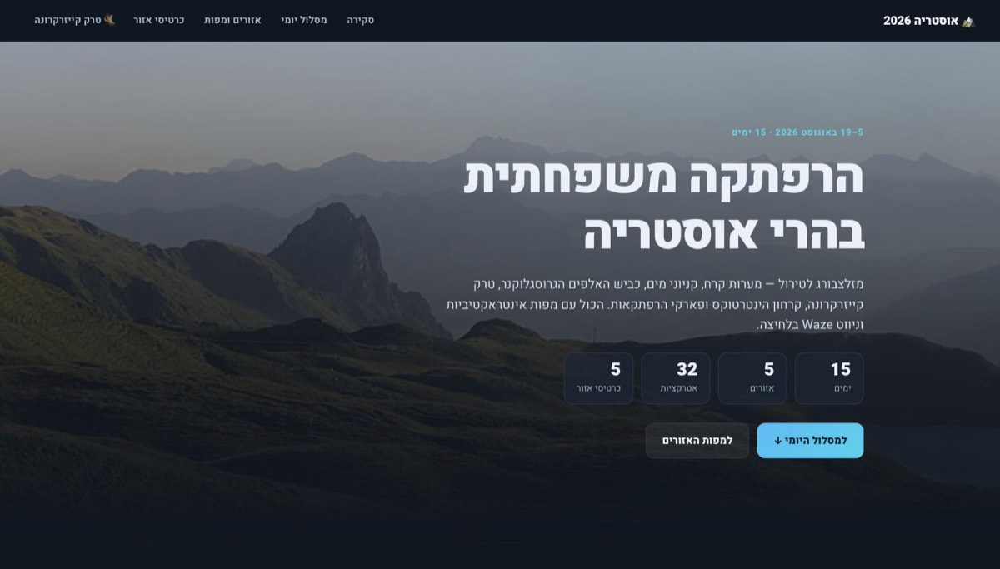
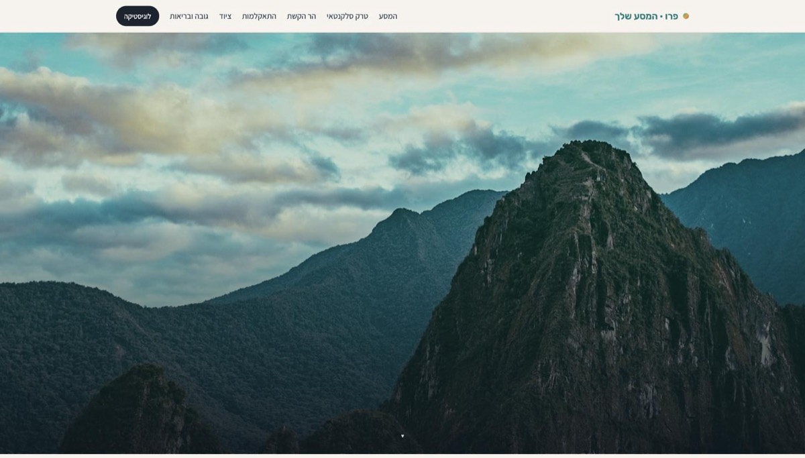

<p align="center">
  
</p>

<p align="center">
  <a href="https://claude.com/claude-code"></a>
  
  
  
  
</p>

<p align="center">
  <b>Give it your bases, dates and kids' ages — get back a trip site you actually use on the road.</b>
</p>

---

## The two pages it builds

|  |  |
|---|---|
| **`index.html`** | Hero with a live countdown, day-by-day itinerary per base, hotels & rental-car table, discount/city-card coverage, opening hours, a rainy-day alternatives bank, and a localStorage packing checklist. |
| **`maps.html` + `maps-data.js`** | An interactive Leaflet map per base: filter by category, search, sort by distance from the hotel, with drive times, opening hours, pass badges, parking, closing-day badges for the destination's rest day, and one-tap navigation in whichever app works there. |

<br>



<p align="center"><sub>Day-by-day timeline — tap a day to open its attractions, photos, lodging and one-tap navigation.</sub></p>

<br>



<p align="center"><sub><code>maps.html</code> — filter by category, search, sort by distance from the hotel, tap Waze or Maps.</sub></p>

<br>

<table>
<tr>
<td width="50%"></td>
<td width="50%"></td>
</tr>
<tr>
<td align="center"><sub>Per-base maps with numbered markers, tied to the itinerary.</sub></td>
<td align="center"><sub>City / guest-card coverage, cross-checked against the plan.</sub></td>
</tr>
</table>

## What makes it different

The value isn't the itinerary prose — any LLM writes "visit the old town." The value is that the site is **real and usable on the trip**:

- 📷 **Real photos, never invented URLs.** `scripts/fetch_photos.py` pulls verified images from Wikimedia Commons and writes an attribution `credits.json`. Anything it can't resolve becomes a gradient tile — never a fake ``.
- 📍 **Verified coordinates, drive times and opening hours** — or an explicit "couldn't confirm."
- 📅 **"Is it open on the day we're going?"** Seasonal ranges, weekday rules and public holidays are evaluated per trip date at build time, so the map answers the actual question instead of showing a string to decode. Costs the page nothing — the table is a few KB and needs no runtime library.
- 🌍 **Works outside Europe.** The closing-day badge follows the destination's actual rest day — Sunday in Austria, Saturday in Israel, Friday in the Gulf, none in Japan or the US. Units switch to miles where people use miles, and the nav buttons only offer apps that work in-country (no Waze in Japan; Naver in South Korea).
- 🎟 **Discount-card coverage** cross-checked so the itinerary and the maps agree.
- 💸 **A per-region deals & savings playbook** — attraction and restaurant coupons, guest/city cards, and region-active apps (Too Good To Go, TheFork).
- 🚀 **Deploys** cleanly to Vercel as plain static files.

Light/dark theme, reveal animations, sticky scroll-spy nav, and full RTL (Hebrew/Arabic) support.

## A real trip built this way

<a href="https://austria-trip-2026-sdanpos-projects.vercel.app/"></a>

<p align="center"><sub>15 days, 5 bases, 32 attractions — in Hebrew, right-to-left. <a href="https://austria-trip-2026-sdanpos-projects.vercel.app/">See it live →</a></sub></p>

## Install

```bash
git clone https://github.com/meiriohad76-oss/trip_planner ~/.claude/skills/trip-planner
```

Then ask Claude Code to build a trip site, or run `/trip-planner`.

**A good first prompt:**

> Build a trip site for our family trip to Austria, 5–19 Aug 2026.
> Bases: Werfenweng (nights 1–3), Ellmau (4–8), Mayrhofen (9–11), Ötz (12–15).
> Kids are 8 and 12. We have a rental car. Hebrew, RTL.

## Layout

```
trip-planner/
├── SKILL.md                    # workflow + guardrails
├── scripts/
│   ├── fetch_places.py         # OpenStreetMap -> maps-data.js (POIs, parking, hours)
│   ├── osm_hours.py            # cautious OSM opening_hours reader, any weekday
│   ├── regions.py              # per-country closing days, units, usable nav apps
│   ├── build_days.py           # precompute per-date open/closed + holidays
│   ├── day_status.js           # opening_hours evaluation (build time, Node)
│   └── fetch_photos.py         # Wikimedia Commons downloader + credits.json
├── references/
│   ├── itinerary.html          # main page template (full design system + JS)
│   ├── maps.html               # interactive Leaflet maps page
│   ├── maps-data.js            # POI data schema with samples
│   └── coupon-research.md      # per-region deals & savings playbook
└── tests/
    ├── test_maps.py            # headless render: coords, ARIA, XSS, mobile
    ├── test_nbase.py           # N-base builds + data/section mismatch errors
    ├── test_fetch_places.py    # OSM transform, against a real-response fixture
    ├── test_regions.py         # AT / IL / SA / JP / US / KR rendering
    ├── test_days.py            # per-date open/closed, seasons, holidays
    └── validate_data.py        # schema check on maps-data.js before deploy
```

## Tests

The templates ship with a headless browser suite, so a change to `maps.html`
can be checked rather than eyeballed:

```bash
pip install playwright && playwright install chromium
python3 tests/test_maps.py
python3 tests/test_nbase.py
```

`test_maps.py` feeds the template deliberately hostile data — string coordinates,
an out-of-range latitude, a missing longitude, a non-numeric drive time and a
name containing `` — and asserts the page degrades cleanly:
bad points are dropped with a console warning instead of throwing, nav links
stay well-formed, the injected markup renders as inert text, and there is no
horizontal overflow at 390px. `test_nbase.py` builds 5 bases and checks that a
data/section mismatch in either direction produces a specific console error.

## Sibling skill

Hiking, running or cycling routes — with GPX, elevation profiles and a terrain-difficulty audit — are a different job. Use **[trail-route-planner](https://github.com/sdanpo/trail-route-planner)** for those.

<a href="https://peru-trek.vercel.app/"></a>

<p align="center"><sub><a href="https://peru-trek.vercel.app/">peru-trek.vercel.app</a> — Salkantay & Machu Picchu, day by day.</sub></p>

---

<p align="center"><sub>
Banner photo by <a href="https://unsplash.com/@olgamandel">Olga Mandel</a> on <a href="https://unsplash.com/photos/KpZWF9Y1YtU">Unsplash</a> ·
Site photos from <a href="https://commons.wikimedia.org/">Wikimedia Commons</a> ·
Maps © <a href="https://www.openstreetmap.org/copyright">OpenStreetMap</a> contributors
</sub></p>
